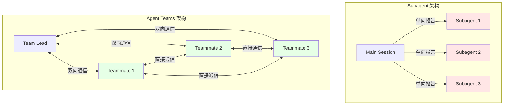
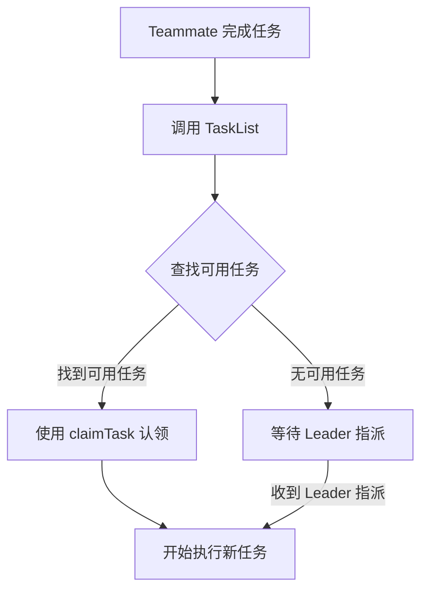
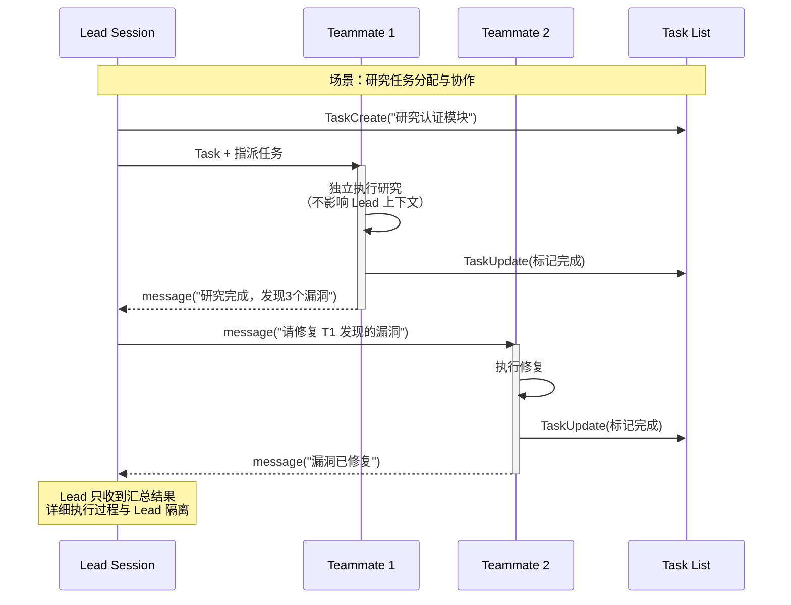
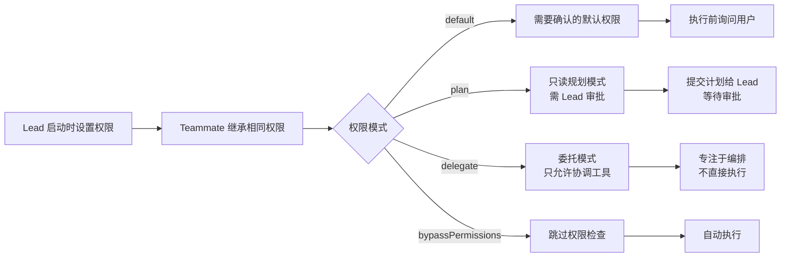
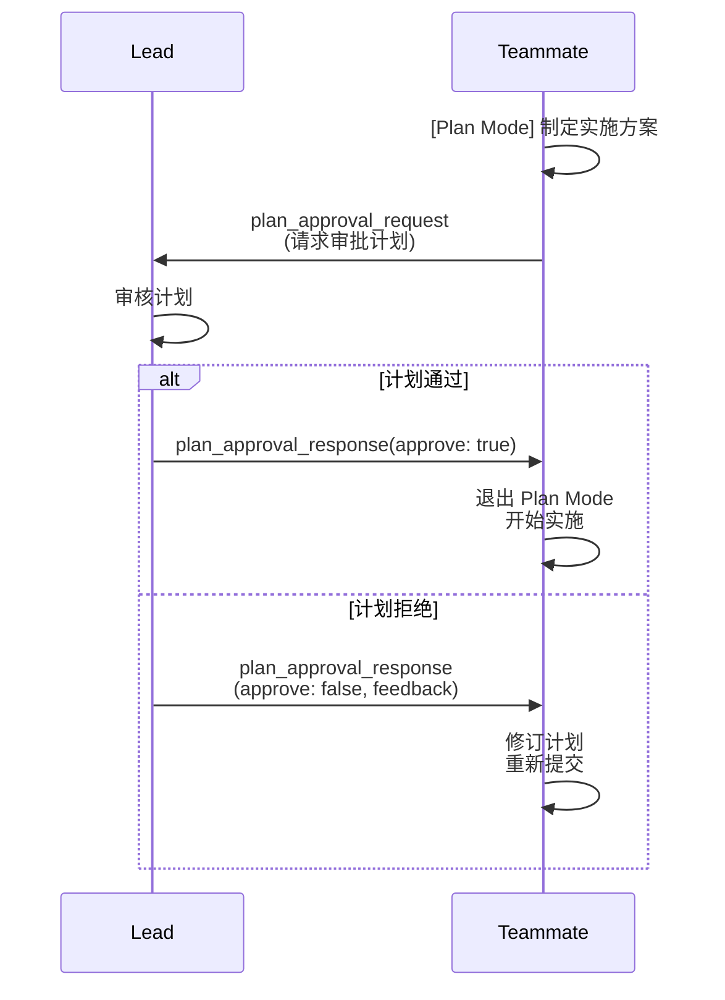
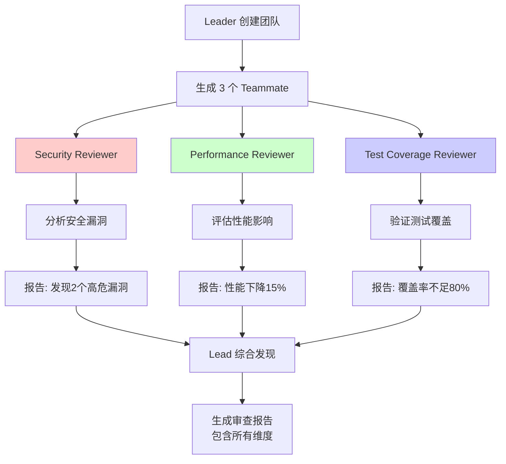
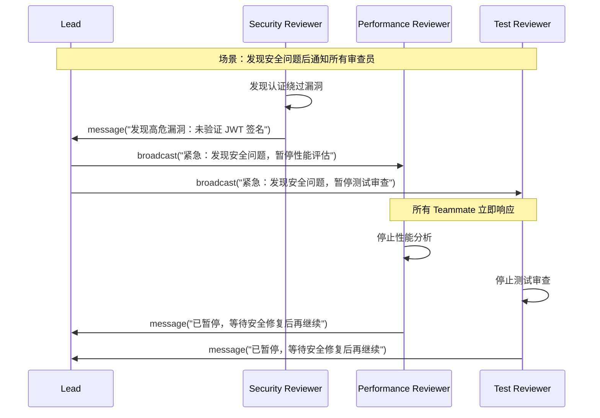

+++
draft = false
date = 2026-02-09T09:20:00+08:00
title = "Claude Code Agent Teams：多智能体协作的优雅实现"
description = "深入解析 Claude Code Agent Teams 的工作原理、架构设计和最佳实践，探讨多智能体编排的核心机制"
slug = "2026-02-09-claude-code-agent-teams-deep-dive"
authors = ["Jas"]
tags = ["Claude", "AI", "Agent", "多智能体"]
categories = ["AI的感想"]
+++

## 引言

在 AI 辅助开发的演进过程中，一个关键挑战是如何让多个智能体高效协作。Claude Code 引入了 Agent Teams 功能，通过一个简洁而优雅的架构实现了多智能体编排。这篇文章将深入分析其设计原理、工作机制和实际应用场景。

引用自：[Claude Code Agent Teams 原理机制深度解析 - V2EX](https://www.v2ex.com/t/1191556)

官方文档：[Claude Code Agent Teams](https://code.claude.com/docs/en/agent-teams)

## 核心架构：分层设计

Claude Code Agent Teams 采用了一种 **Lead-Teammate 分层架构**，这种设计的核心在于通过最小化的改动实现了多智能体协作能力。

### 四个核心组件

Agent Teams 由四个核心组件构成：

| 组件 | 角色 |
|------|------|
| **Team Lead** | 主会话，负责创建团队、生成队友、协调工作 |
| **Teammates** | 独立的 Claude Code 实例，各自处理分配的任务 |
| **Task List** | 共享的工作项列表，队友认领并完成任务 |
| **Mailbox** | 智能体间的消息传递系统 |

<!--more-->

## 与传统 Subagent 的区别

理解 Agent Teams 的关键在于明白它与 Subagent 的本质差异：



**关键差异：**
- **Subagent**：运行在同一个会话中，只能单向向主代理报告，其执行过程会完整流入主会话的上下文
- **Teammates**：运行在独立实例中，彼此可以直接通信，执行过程与 Lead 隔离

## 三种任务分配模式

Agent Teams 支持灵活的任务分配策略：

### 1. Lead Assigns（Leader 分配）

Leader 明确指定任务给特定的 Teammate：

```json
{
  "type": "message",
  "recipient": "researcher",
  "content": "请开始调研认证模块的安全漏洞",
  "summary": "认证模块调研任务分配"
}
```

### 2. Self-Claim（自主认领）

Teammate 完成当前任务后，自动从任务列表中认领下一个可用任务。认领遵循以下规则：
- 优先选择状态为 "pending" 的任务
- 无负责人（no owner）
- 没有阻塞依赖（blockedBy 为空）
- **优先选择 ID 顺序靠前的任务**（最小 ID 优先）



### 3. Delegation Mode（委托模式）

限制 Leader 只能使用协调工具（创建队友、发送消息、关闭队友、管理任务），不能直接执行任务。这种方式确保 Leader 专注于编排而非实现。

## 消息系统与通信隔离

### 五种消息类型

Agent Teams 的消息系统提供了丰富的通信模式：

| 消息类型 | 用途 | 适用场景 |
|---------|------|---------|
| `message` | 私信单个队友 | 日常沟通、任务跟进、反馈 |
| `broadcast` | 广播给所有队友 | 紧急问题、重大公告（慎用） |
| `shutdown_request` | 请求队友关闭 | 任务完成，要求优雅退出 |
| `shutdown_response` | 响应关闭请求 | 同意或拒绝关闭 |
| `plan_approval_response` | 审批计划 | 批准或拒绝队友的实施方案 |

### 隔离机制详解

理解 Teammate 与 Lead 的通信隔离是掌握 Agent Teams 的关键：



**关键特性：**
- Teammate 的详细执行过程不会自动流入 Lead 的上下文
- 必须通过 `SendMessage` 工具传递信息
- 消息自动送达，无需手动检查收件箱

### 消息权限控制

每个 Teammate 启动时继承 Lead 的权限设置。权限控制包括：



**Plan Mode 工作流程：**


## 实际应用场景：代码审查

让我们通过一个具体场景来展示 Agent Teams 的协作能力：

### 场景：并行代码审查

创建一个团队来审查 PR #142，三个审查员从不同角度分析：

```bash
Create an agent team to review PR #142. Spawn three reviewers:
- One focused on security implications
- One checking performance impact  
- One validating test coverage
Have them each review and report findings.
```

### 协作流程



### 消息协作示例



## 优雅的非侵入式设计

Claude Code Agent Teams 的设计哲学体现了对现有生态的尊重：

### System Prompt 的渐进式变更

启用 Agent Teams 后，系统提示词仅通过增量添加章节来实现功能：

```markdown
# Agent Teammate Communication
IMPORTANT: You are running as an agent in a team. To communicate with anyone on your team:
- Use the SendMessage tool with type `message` to send messages to specific teammates
- Use the SendMessage tool with type `broadcast` sparingly for team-wide announcements

Just writing a response in text is not visible to others on your team - you MUST use the SendMessage tool.
```

**设计的优雅之处：**
- 不破坏原有功能
- 不重构整个系统
- 通过增量扩展实现新能力

## 工具体系扩展

启用 Agent Teams 后，原有工具被扩展以支持团队协作：

### TaskCreate 的变化

新版本增加了团队分配能力：

```json
{
  "name": "Spawned agent name",
  "team_name": "Team name (uses current context if omitted)",
  "mode": "Permission mode: acceptEdits | bypassPermissions | default | delegate | dontAsk | plan"
}
```

### TaskList 的新增

- **新增使用场景**："Before assigning tasks to teammates, to see what's available"
- **新增关联工具**：`assignTask`（用于任务分配）

### 全新工具

1. **TeamCreate**：创建团队上下文
2. **TeamDelete**：销毁团队资源
3. **SendMessage**：丰富的消息传递系统

## 最佳实践

### 1. 合理使用广播

广播会向每个 Teammate 发送单独消息，成本随团队规模线性增长。仅在真正需要时使用：
- 发现阻塞性 bug
- 影响所有人的重大公告

### 2. 始终使用名称引用

使用 Teammate 的名称（如 "team-lead"、"researcher"），不要使用 UUID。

### 3. 理解空闲状态

Teammate 的空闲状态是正常的——空闲只意味着在等待输入，不代表出错。

### 4. 使用 TaskUpdate 标记完成

不要发送 JSON 格式的状态消息，使用 TaskUpdate 标记任务完成，系统会自动发送空闲通知。

### 5. 避免文件冲突

确保每个 Teammate 拥有不同的文件集合，避免编辑同一文件导致的覆盖问题。

## 当前局限性

作为实验性功能，Agent Teams 仍有一些限制：

- **无会话恢复**：in-process 模式下的 Teammate 无法通过 `/resume` 恢复
- **任务状态可能滞后**：Teammate 有时未能正确标记任务完成
- **关闭速度较慢**：Teammate 完成当前请求后才会关闭
- **每会话一个团队**：Lead 只能管理一个团队
- **无嵌套团队**：Teammate 不能创建自己的团队
- **Leader 固定**：创建团队的会话始终是 Lead
- **启动时统一权限**：无法在生成时设置独立权限

## 总结

Claude Code Agent Teams 代表了自然语言多智能体编排的优雅方案。它通过以下设计理念实现了高效协作：

1. **非侵入式扩展**：在原有基础上增量添加功能
2. **基于消息的松耦合**：独立实例通过消息系统通信
3. **任务驱动协调**：复用并扩展了任务系统
4. **灵活的权限控制**：支持多种权限模式和审批流程

虽然在最佳实践和细节优化上还有提升空间，但其架构设计的清晰性和与生态的紧密结合，值得作为多智能体编排的参考范例。

## 参考来源

- [Claude Code Agent Teams 原理机制深度解析 - V2EX](https://www.v2ex.com/t/1191556)
- [Claude Code Agent Teams 官方文档](https://code.claude.com/docs/en/agent-teams)
