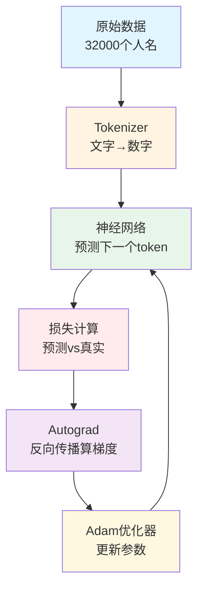
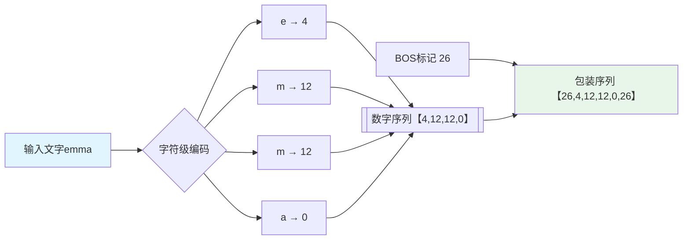
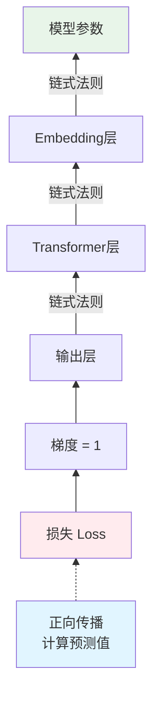
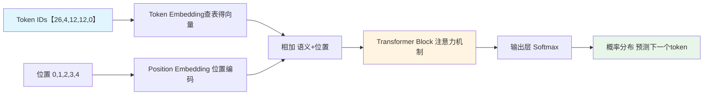
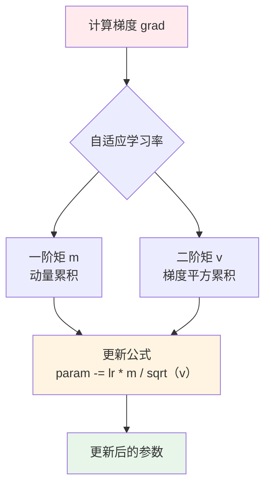
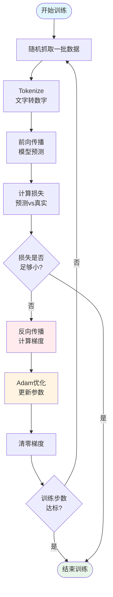
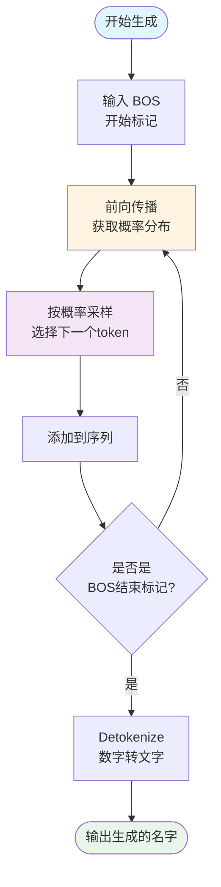
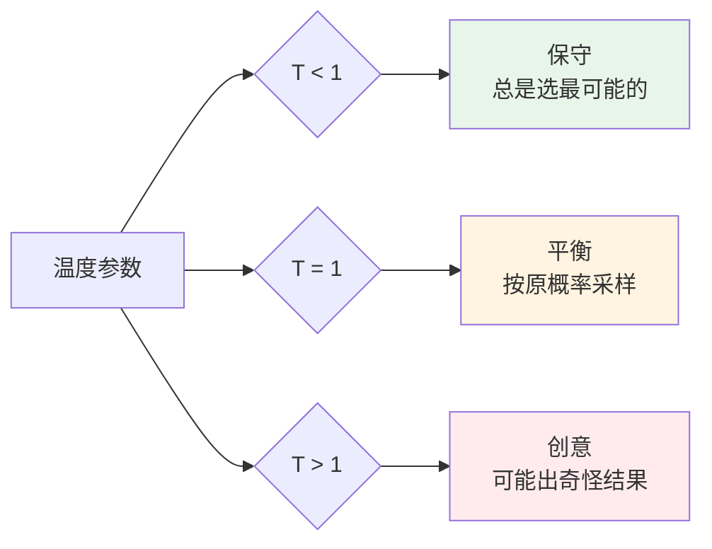
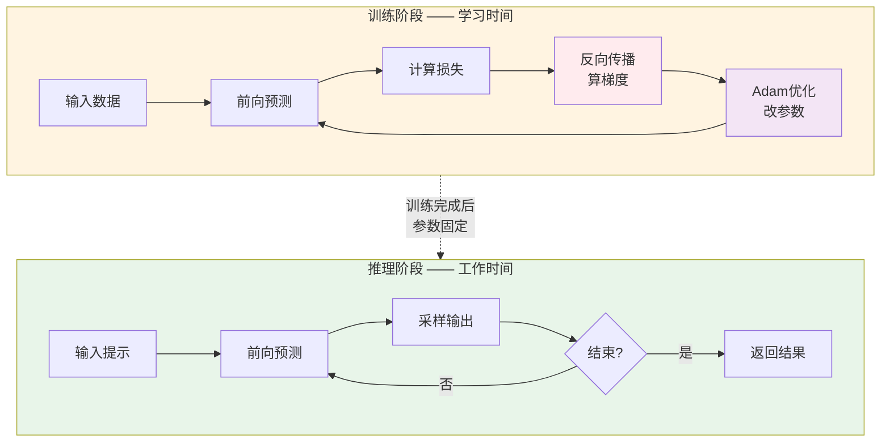

+++
draft = false
date = "2026-03-01T13:45:00+08:00"
title = "MicroGPT 极简解析：200行代码读懂大语言模型本质"
description = "用大白话解读 Andrej Karpathy 的 MicroGPT 项目，从零开始理解 GPT 的每个组成部分"
slug = "microgpt-explained-simple"
categories = ["技术解析"]
tags = ["GPT", "AI", "深度学习", "Karpathy", "Python", "教程"]
+++

> "你不能真正理解一个东西，除非你能把它简化到最本质的形式。" — Andrej Karpathy

**原文出处**：本文基于 Andrej Karpathy 的 [MicroGPT 项目](https://karpathy.github.io/2026/02/12/microgpt/) 进行解读和整理。

## 什么是 MicroGPT？

想象有人用 200 行 Python 代码，不借助任何外部工具，从零搭建了一个能"说话"的 AI。这就是 **MicroGPT** —— AI 大神 Andrej Karpathy 的最新"艺术作品"。

它的目标很简单：**把 GPT 简化到无法再简化的程度**，让任何人都能一眼看明白大语言模型到底在干什么。

---

## MicroGPT 整体流程图

在开始详解每个部分之前，先看一下 MicroGPT 的完整工作流程：



**训练阶段**：循环执行 ①→②→③→④→⑤→①，重复 20,000 次

**推理阶段**：只需 ①→②，循环生成直到遇到结束标记

---

## 第一部分：Dataset（数据集）—— AI 的"食物"

### 本质是什么？
**AI 需要学习材料，就像学生需要课本。**

### 大白话解释
MicroGPT 使用了一个极简数据集：32000 个英文人名，每行一个：

```
emma
olivia
ava
isabella
sophia
...
```

Karpathy 选择这个名字数据集是有深意的：
- **规则简单**：人名有固定的字母组合规律
- **容易理解**：每个人都能判断"kamon"听起来像不像一个名字
- **足够复杂**：能展示出 AI 学习"模式"的能力

### 核心思想
AI 的本质是**统计机器**。你给它看足够多的例子，它就能学会隐藏在数据背后的规律，然后生成类似的全新内容。

训练完成后，MicroGPT 能生成这样的"新名字"：
```
kamon, karai, keylen, vialan, karia...
```

这些名字世界上可能根本不存在，但它们**听起来像**真正的名字。这就是 AI 的魔力：**不是记忆，而是创造**。

---

## 第二部分：Tokenizer（分词器）—— AI 的"翻译官"

### 本质是什么？
**把人类文字转换成 AI 能理解的数字，再把数字翻译回文字。**

### 大白话解释
神经网络只认识数字，不认识字母。所以我们需要一个"翻译官"：

**MicroGPT 的做法（极简版）：**
- 收集所有出现过的字符（a-z）
- 给每个字符分配一个编号：a=0, b=1, c=2...
- 额外加一个特殊符号 BOS（Beginning of Sequence）= 26

```
"emma" → [4, 12, 12, 0]  （e=4, m=12, m=12, a=0）
```

### 核心思想
这些数字本身没有任何含义！`0` 代表 'a' 只是人为约定。重要的是：**每个符号都是一个独立的、离散的 token**。

Karpathy 特别强调：这些数字换成表情包也行，它们只是不同类别的标签。

### 为什么需要 BOS？
BOS（序列开始标记）就像一个"哨兵"：
- 告诉模型："一个新的名字开始了"
- 也告诉模型："这个名字结束了"

训练时，每个名字变成：`[BOS, e, m, m, a, BOS]`

模型学到：看到 BOS 就开始生成新名字，再看到 BOS 就停下来。

### Tokenizer 工作流程



**关键理解**：文字和数字只是不同形式的标签，神经网络只认数字。

---

## 第三部分：Autograd（自动微分）—— AI 的"自我纠错系统"

### 本质是什么？
**让 AI 知道自己哪里错了，以及如何改正。**

### 大白话解释
这是 MicroGPT 中最精妙的部分。Karpathy 用 **60 行代码** 实现了一个微型 PyTorch！

#### 核心概念：Value 类
```python
class Value:
    def __init__(self, data):
        self.data = data  # 当前数值（正向传播算出）
        self.grad = 0     # 梯度（反向传播算出）
```

每个 `Value` 就像一个有记忆的数字：
- `data`：这个数的当前值
- `grad`：如果这个数变化一点点，最终目标会变化多少

#### 举个生活例子
假设你在调收音机的音量（目标：找到最佳音量）：
- **正向传播**：转动旋钮，听到声音 → 这就是 `data`
- **反向传播**：感觉声音太大/太小，决定往哪个方向调、调多少 → 这就是 `grad`

#### 怎么实现的？
Value 类重载了所有数学运算符（+, -, *, /, pow, log, exp...）：

```python
def __mul__(self, other):
    # 乘法：a * b = c
    result = Value(self.data * other.data)
    # 记录：如果 c 变了，a 要承担多少责任？
    # 答案是 b（因为 d(a*b)/da = b）
    result._local_grads = (other.data, self.data)
    return result
```

#### 反向传播的本质
```python
def backward(self):
    # 从终点往回走
    for node in reversed(topological_order):
        # 把责任分摊给每个输入
        for child, local_grad in zip(children, local_grads):
            child.grad += local_grad * node.grad
```

Karpathy 用一句话总结：**链式法则只是乘法，拓扑排序只是确保顺序正确。**

### 核心思想
深度学习训练 = ** millions 次试错**

每次试错后，Autograd 告诉每个参数："你闯的祸有多大？下次怎么改？"

这就是 AI "学习"的真相：**不是理解，而是统计意义上的参数调优**。

### Autograd 反向传播流程



**核心原理**：链式法则就像「责任追究」——从最终结果往回推，每个环节承担多少责任。

---

## 第四部分：神经网络架构 —— AI 的"大脑结构"

### 本质是什么？
**一组数学函数，把输入的数字变成输出的概率。**

### 大白话解释
GPT 的"大脑"由三个核心组件构成：

#### 1. Token Embedding（词嵌入）—— "查字典"
```python
# 27 个 token，每个用一个 48 维向量表示
self.wte = [Value(random.randn(48)) for _ in range(27)]
```

本质：把整数 token ID 变成一个「语义向量」。

想象：每个词都有一个「个性档案」，48 个数字描述这个词的「性格特征」。

#### 2. Position Embedding（位置编码）—— "记住顺序"
```python
# 32 个位置，每个位置用一个 48 维向量
self.wpe = [Value(random.randn(48)) for _ in range(32)]
```

本质：告诉模型"这个词出现在第几个位置"。

为什么重要？因为 "狗咬人" 和 "人咬狗" 是完全不同的意思，但 token 完全一样！位置信息让它们区分开。

#### 3. Transformer Block（变形金刚模块）—— "注意力机制"

这是 GPT 的核心创新。MicroGPT 实现了一个简化版：

**Self-Attention（自注意力）的本质：**
- 每个词都问其他词："你们和我有关系吗？"
- 通过计算「相似度」决定注意力权重
- 然后「加权求和」得到新的表示

```
"猫坐在垫子上"

"垫子" 看周围：
- 和"猫"关系强（猫坐的地方）
- 和"坐"关系中等（动作的对象）
- 和"上"关系强（位置词）

最终，"垫子"的新表示 = 融合了这些相关信息的向量
```

#### 4. 输出层 —— "猜下一个词"

经过所有处理，模型输出一个 27 维的向量，经过 softmax 变成概率分布：

```
P(下一个词是 'a') = 0.15
P(下一个词是 'b') = 0.03
P(下一个词是 BOS) = 0.42  ← 最可能
...
```

### 核心思想
**预测下一个词 = 理解语言**

如果模型能准确预测 "I love" 后面应该接 "you" 而不是 "苹果"，说明它真的"理解"了英语。

### 神经网络数据流



**关键理解**：模型不是直接预测文字，而是预测「下一个 token 的概率分布」。

---

## 第五部分：Adam Optimizer（优化器）—— AI 的"教练"

### 本质是什么？
**决定每次参数调整的步长和方向。**

### 大白话解释
训练神经网络就像下山：
- **目标**：找到山谷最低点（损失最小）
- **问题**：山很陡、雾很大，你看不清路
- **Adam**：一个聪明的向导，根据历史经验调整步伐

#### 梯度下降 vs Adam

**简单梯度下降**：
```python
param = param - learning_rate * param.grad
```
问题：梯度大时步子太大（冲过头），梯度小时步子太小（太慢）。

**Adam 改进**：
1. **动量（Momentum）**：记住之前的方向，保持惯性
2. **自适应学习率**：自动调整每个参数的步伐

```python
# Adam 核心（简化版）
m = beta1 * m + (1-beta1) * grad  # 一阶矩（动量）
v = beta2 * v + (1-beta2) * grad**2  # 二阶矩（自适应）
param = param - lr * m / sqrt(v)
```

### 核心思想
**学习是一个动态过程**，不能一视同仁：
- 有些参数变化剧烈 → 要「刹刹车」
- 有些参数总是很小 → 要「加加速」
- 有些方向一致 → 要「保持惯性」

Adam 就是调节这些的「智能教练」。

### Adam 优化流程



**核心思想**：不同参数需要不同的学习速度，Adam 自动调节每个参数的「步伐大小」。

---

## 第六部分：训练循环 —— AI 的"寒窗苦读"

### 本质是什么？
**让 AI 看例子、算误差、调参数，重复 millions 次。**

### 大白话解释
```python
for step in range(max_steps):
    # 1. 随机抓一批数据
    batch = random_sample(docs)
    
    # 2. 前向传播：预测
    logits = model(batch)
    
    # 3. 算损失：预测 vs 真实的差距
    loss = cross_entropy(logits, targets)
    
    # 4. 反向传播：谁该为错误负责
    loss.backward()
    
    # 5. 更新参数：改错
    optimizer.step()
    
    # 6. 清零梯度，准备下一轮
    model.zero_grad()
```

### 训练在干什么？
想象你在教小孩认字：
1. 给他看一个字 "猫"
2. 他猜 "狗"
3. 你说："错了，是猫"
4. 他调整大脑连接："原来长这样的是猫"
5. 重复 millions 次

**AI 训练完全一样**，只是「调整大脑连接」变成了「调整数字参数」。

### MicroGPT 的训练数据
- 32,000 个人名
- 训练 20,000 步
- 每步看 32 个名字

最终损失从 ~3.3 降到 ~1.9，模型学会了「人名的统计规律」。

### 训练循环详细流程



**MicroGPT 训练规模**：32,000 个名字 × 20,000 步 = 约 6 亿次参数更新

---

## 第七部分：推理循环 —— AI 的"说话方式"

### 本质是什么？
**一个词一个词地「接龙」，直到说完。**

### 大白话解释
训练好的模型怎么用？很简单：

```python
# 从 BOS 开始
tokens = [BOS]

while True:
    # 1. 模型预测下一个词的概率
    probs = model(tokens)
    
    # 2. 按概率随机采样
    next_token = sample(probs)
    
    # 3. 加到序列中
    tokens.append(next_token)
    
    # 4. 如果采样到 BOS，说明名字结束了
    if next_token == BOS:
        break

# 把 tokens 转换回文字
name = tokenizer.decode(tokens)
```

### 为什么能生成合理的内容？
因为训练时，模型学会了：
- "k" 后面常跟 "a"、"i"、"o"
- 名字通常 3-8 个字母
- 元音和辅音要交替

所以它采样时，大概率会生成听起来像名字的东西。

### 温度的作用
```python
# temperature = 1.0: 按原概率采样
# temperature < 1.0: 更"确定"，选概率最高的
# temperature > 1.0: 更"随机"，可能出奇怪结果
```

低温 = 保守（总是"emma"）
高温 = 创意（可能"xyz123"）

### 推理生成流程



**关键理解**：生成是「重复预测+采样」的过程，直到遇到结束标记。

### 温度的作用



**例子**：
- **T=0.1**（低温）：总是 "emma", "olivia" —— 安全但无聊
- **T=1.0**（中温）："kamon", "karai" —— 合理且多样
- **T=2.0**（高温）："xyz123", "qqqqq" —— 可能不符合规则

---

## 🔄 训练 vs 推理：流程对比



**关键区别**：
- **训练**：需要「试错-纠错」循环，目的是**学习参数**
- **推理**：只用前向传播，目的是**生成结果**，参数不变

---

## 🤔 最后思考：MicroGPT 告诉我们什么？

### 1. **复杂的东西本质是简单的**
ChatGPT 和 MicroGPT 在原理上没有本质区别，只是规模差了 10000 倍。

### 2. **AI 没有理解，只有统计**
MicroGPT 生成 "kamon" 时，它并不知道这是一个名字，它只是按照统计规律「接龙」而已。

### 3. **规模就是一切**
小模型只能做小游戏（生成名字），大模型才能做复杂任务（写文章、编代码）。但**底层机制是一样的**。

### 4. **深度学习 = 积木游戏**
每个组件都很简单（矩阵乘法、softmax、attention），但组合起来就产生了「智能」。

---

## 📚 参考来源

### 原文及代码
- **[MicroGPT 官方博客](https://karpathy.github.io/2026/02/12/microgpt/)** - Andrej Karpathy 的原文介绍
- **[MicroGPT 源代码](https://gist.github.com/karpathy/8627fe009c40f57531cb18360106ce95)** - GitHub Gist 完整代码
- **[MicroGPT 网页版](https://karpathy.ai/microgpt.html)** - 可交互的在线版本
- **[Google Colab 笔记本](https://colab.research.google.com/drive/1vyN5zo6rqUp_dYNbT4Yrco66zuWCZKoN?usp=sharing)** - 可直接运行的代码

### 相关学习资源
- [Karpathy 的 micrograd 视频（2.5 小时详解自动微分）](https://www.youtube.com/watch?v=VMj-3S1tku0)
- [makemore 项目](https://github.com/karpathy/makemore) - 字符级语言模型基础
- [nanoGPT 项目](https://github.com/karpathy/nanoGPT)** - 更大规模的 GPT 实现

---

**感谢 Andrej Karpathy 为我们揭开 AI 的神秘面纱。** 🙏

这 200 行代码告诉我们：最深刻的理解，往往来自最简单的实现。
