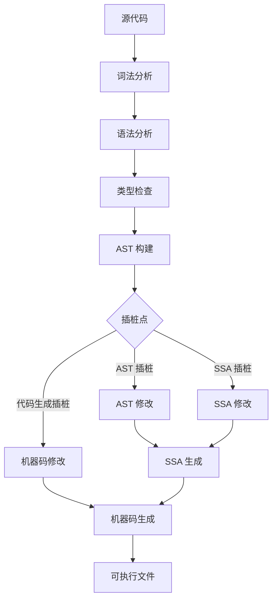
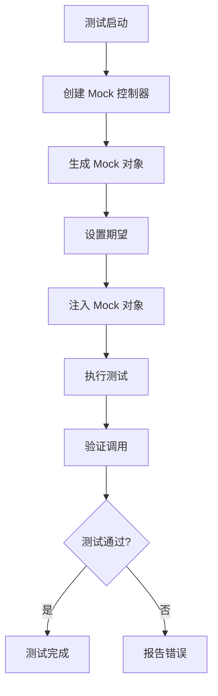
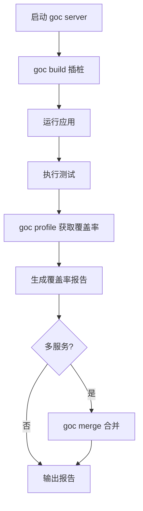

<!--more-->

## 背景：JVM Sandbox 是什么？

JVM sandbox 是 Java 生态中一个强大的工具，它能够在运行时对 Java 应用进行字节码级别的操作，包括：

- **字节码增强**：在类加载时修改字节码
- **类转换**：在类加载时替换整个类
- **方法拦截**：通过 Java agent 在运行时拦截方法调用
- **Mock 注入**：通过自定义类加载器或运行时注入 mock 类
- **AOP 框架**：Spring AOP 可以在类加载时织入横切逻辑
- **动态代理**：通过 CGLib 或 ASM 在运行时生成代理类

但是，对于像 Go 这样静态编译型的语言来说，由于缺乏类似 Java 的 JVM 运行时环境，实现真正的运行时字节码注入是不可能的。Go 是静态编译语言，编译后的代码直接运行在操作系统上。

不过，我们可以通过一些技术手段实现类似的功能。下面我们详细分析各种可行的方案。

---

## 1. Monkey Patching - 运行时函数替换

**项目**: [bouk/monkey](https://github.com/bouk/monkey)

这是最接近 JVM sandbox 运行时注入能力的方案。

### 原理

通过直接修改内存中的可执行代码实现函数替换：

1. Go 函数在内存中的代码段默认是可执行的（只读+执行权限）
2. 通过 `mprotect` syscall 修改内存页权限为可写+可执行
3. 在函数入口处写入跳转指令（jmp），跳转到替换函数
4. 替换函数执行时，如需调用原函数，使用 `PatchGuard`

### 代码示例

```go
package main

import (
    "fmt"
    "strings"
    "bou.ke/monkey"
)

func main() {
    monkey.Patch(fmt.Println, func(a ...interface{}) (n int, err error) {
        s := make([]interface{}, len(a))
        for i, v := range a {
            s[i] = strings.Replace(fmt.Sprint(v), "hell", "*bleep*", -1)
        }
        return fmt.Fprintln(os.Stdout, s...)
    })
    fmt.Println("what the hell?") // 输出: what the *bleep*?
}
```

### 限制

- **内联优化**: 需要禁用内联 (`go test -gcflags=-l`)
- **安全性**: 在某些安全导向的 OS 上不可用（内存页不能同时可写可执行）
- **线程安全**: 非线程安全
- **平台限制**: 仅支持 Unix-based x86/x86-64 系统
- **生产环境**: 仅建议用于测试环境

**参考文档**:
- GitHub: https://github.com/bouk/monkey
- 博客: https://bou.ke/blog/monkey-patching-in-go/

---

## 2. Go 原生覆盖率工具

**命令**: `go test -cover`

### 实现原理

编译时插桩：

1. 在编译时，`go tool cover` 在函数入口和出口插入计数器代码
2. 生成覆盖率报告
3. 插桩位置: 函数的开始和结束

### 代码示例

```go
// 原始代码
func add(a, b int) int {
    return a + b
}

// 编译后（简化示例）
func add(a, b int) int {
    coverCount[0]++  // 入口计数
    defer func() { coverCount[1]++ }()  // 出口计数
    return a + b
}
```

### 限制

- **测试范围**: 主要用于单元测试
- **运行时覆盖**: 不支持运行时覆盖率统计
- **精细度**: 函数级别，非语句级别

**参考文档**:
- 官方文档: https://go.dev/blog/cover
- 源码: https://github.com/golang/go/blob/master/src/cmd/cover/cover.go

---

## 3. Goc - 系统测试覆盖率工具

**项目**: [qiniu/goc](https://github.com/qiniu/goc)

这是专门用于系统测试的覆盖率工具，解决了原生覆盖率工具的限制。

### 特点

- **运行时覆盖率**: 支持在应用运行时收集覆盖率数据
- **系统测试**: 支持集成测试、端到端测试场景
- **服务注册**: 自动注册服务到 goc server
- **覆盖率合并**: 支持多个服务的覆盖率合并
- **覆盖率清除**: 支持运行时清除覆盖率计数器

### 使用流程

```bash
# 1. 启动 goc 服务端
goc server

# 2. 使用 goc 构建目标服务（会自动插桩）
goc build .

# 3. 运行生成的二进制文件
./your-app

# 4. 获取覆盖率数据
goc profile
```

### 优势

- ✅ 专为系统测试设计
- ✅ 支持运行时覆盖率统计
- ✅ 支持微服务场景
- ✅ 功能全面

### 限制

- ⚠️ 需要额外的构建步骤
- ⚠️ 需要启动 goc server

**参考文档**:
- GitHub: https://github.com/qiniu/goc
- 中文文档: https://github.com/qiniu/goc/blob/master/README_zh.md

---

## 4. Mock 框架对比

### 4.1 Uber-go/mock (推荐)

**项目**: [uber-go/mock](https://github.com/uber-go/mock)

这是 Google `golang/mock` 的活跃维护分支（原项目已停止维护）。

**特点**:
- **代码生成**: 支持 source/package/archive 三种模式
- **类型安全**: 编译时检查
- **集成良好**: 与 Go 标准库 `testing` 包集成
- **高级功能**: 支持自定义 matcher、DoAndReturn
- **自动清理**: Go 1.14+ 版本自动调用 `ctrl.Finish()`

**安装**:
```bash
go install go.uber.org/mock/mockgen@latest
```

**示例**:
```go
func TestFoo(t *testing.T) {
    ctrl := gomock.NewController(t)
    m := NewMockFoo(ctrl)
    m.EXPECT().Bar(gomock.Eq(99)).Return(101)
    SUT(m)
}
```

### 4.2 Testify/mock

**项目**: [stretchr/testify](https://github.com/stretchr/testify)

**特点**:
- **手动编写**: 需要手动创建 mock 结构体
- **简单易用**: 使用 `On()` 和 `Return()` 设置期望
- **配合良好**: 与 testify 的 assert/require 包配合
- **可选生成**: 可配合 mockery 工具自动生成

**示例**:
```go
func TestSomething(t *testing.T) {
    testObj := new(MyMockedObject)
    testObj.On("DoSomething", 123).Return(true, nil)
    targetFuncThatDoesSomethingWithObj(testObj)
    testObj.AssertExpectations(t)
}
```

### Mock 框架对比总结

| 特性 | Uber-go/mock | Testify/mock |
|------|--------------|--------------|
| 代码生成 | mockgen 工具 | mockery 工具 (可选) |
| 类型安全 | 强 (编译时检查) | 中 (运行时检查) |
| 学习曲线 | 较陡 | 平缓 |
| 社区支持 | Uber 维护，活跃 | 社区维护，广泛使用 |
| 性能 | 优 | 良 |
| 推荐度 | ⭐⭐⭐⭐⭐ | ⭐⭐⭐⭐ |

---

## 5. 依赖注入框架

### 5.1 Wire (Google) - 编译时注入

**项目**: [google/wire](https://github.com/google/wire)

⚠️ **已停止维护** (官方提示不再维护)

**特点**:
- **编译时代码生成**: 无运行时开销
- **无反射**: 类型安全
- **依赖关系在编译时确定**
- **生成的代码可读、可调试**

**工作原理**:
1. 定义 `wire.go` 文件描述依赖图
2. 运行 `wire` 命令生成 `wire_gen.go`
3. 生成的代码是普通的 Go 代码

**适用场景**:
- ⚠️ 不推荐新项目使用（项目已停止维护）
- 现有项目可继续维护

### 5.2 Fx (Uber) - 运行时注入

**项目**: [uber-go/fx](https://github.com/uber-go/fx)

**特点**:
- **运行时依赖注入**: 基于反射
- **应用框架级别**: 不只是 DI 容器
- **生命周期管理**: 支持启动/停止钩子
- **消除全局状态**: 避免 `init()` 函数
- **Uber 内部使用**: 几乎所有 Go 服务的核心框架

**核心概念**:
- `fx.Provide`: 提供依赖
- `fx.Invoke`: 调用函数
- `fx.Lifecycle`: 生命周期钩子

**示例**:
```go
func main() {
    app := fx.New(
        fx.Provide(NewDB, NewService),
        fx.Invoke(RunServer),
    )
    app.Run()
}
```

### 5.3 Dig (Uber) - 底层 DI 工具包

**项目**: [uber-go/dig](https://github.com/uber-go/dig)

**特点**:
- **基于反射的 DI 工具包**
- **Fx 的底层实现**
- **可独立使用**: 不依赖 Fx
- **轻量级**: 仅提供 DI 容器功能

**示例**:
```go
c := dig.New()
c.Provide(NewDB)
c.Provide(NewService)
c.Invoke(func(s *Service) {
    // 使用 service
})
```

### 依赖注入框架对比总结

| 特性 | Wire | Fx | Dig |
|------|------|----|----|
| 注入时机 | 编译时 | 运行时 | 运行时 |
| 反射 | 无 | 有 | 有 |
| 生命周期管理 | 无 | 有 | 无 |
| 学习曲线 | 中 | 高 | 低 |
| 维护状态 | ❌ 停止维护 | ✅ 活跃 | ✅ 活跃 |
| 推荐度 | ⚠️ 不推荐新项目 | ⭐⭐⭐⭐⭐ | ⭐⭐⭐⭐ |

---

## 6. 动态方法调用

### 6.1 反射 (Reflect)

Go 标准库 `reflect` 包提供了基础的反射能力。

**能力**:
- 检查类型信息
- 获取/设置字段值
- 调用方法

**限制**:
- 性能较差（反射比直接调用慢）
- 类型不安全（运行时检查）
- 代码可读性下降

**示例**:
```go
func callMethod(obj interface{}, name string, args ...interface{}) ([]interface{}, error) {
    v := reflect.ValueOf(obj)
    method := v.MethodByName(name)
    if !method.IsValid() {
        return nil, fmt.Errorf("method not found")
    }
    inArgs := make([]reflect.Value, len(args))
    for i, arg := range args {
        inArgs[i] = reflect.ValueOf(arg)
    }
    results := method.Call(inArgs...)
    out := make([]interface{}, len(results))
    for i, result := range results {
        out[i] = result.Interface()
    }
    return out, nil
}
```

### 6.2 expr - 表达式引擎

**项目**: [expr-lang/expr](https://github.com/expr-lang/expr)

这是一个功能强大的表达式引擎，可以动态评估表达式并执行方法调用。

**特点**:
- **内存安全**: 无内存漏洞
- **无副作用**: 表达式评估不会改变状态
- **总是终止**: 防止无限循环
- **Go 无缝集成**: 不需要重新定义类型
- **类型检查**: 编译时检查类型正确性
- **性能优化**: 使用字节码虚拟机
- **内置函数**: `all`, `none`, `any`, `one`, `filter`, `map` 等

**示例**:
```go
package main

import (
    "fmt"
    "github.com/expr-lang/expr"
)

func main() {
    env := map[string]interface{}{
        "greet": "Hello, %v!",
        "names": []string{"world", "you"},
        "sprintf": fmt.Sprintf,
    }
    code := `sprintf(greet, names[0])`
    program, _ := expr.Compile(code, expr.Env(env))
    output, _ := expr.Run(program, env)
    fmt.Println(output)
}
```

### 6.3 gRPC Reflection

gRPC 服务反射功能允许客户端通过反射 API 查询服务定义并动态调用方法。

**特点**:
- **无需预定义 schema**: 运行时获取服务定义
- **适合调试工具**: 方便调试和测试
- **性能较低**: 反射开销

**参考文档**:
- gRPC Reflection: https://github.com/grpc/grpc/blob/master/doc/server-reflection.md

---

## 7. 中间件模式

在 HTTP/gRPC 层面，通过中间件可以实现函数拦截和 mock。

**示例 (HTTP)**:
```go
func loggingMiddleware(next http.Handler) http.Handler {
    return http.HandlerFunc(func(w http.ResponseWriter, r *http.Request) {
        log.Printf("Request: %s %s", r.Method, r.URL.Path)
        next.ServeHTTP(w, r)
    })
}
```

**示例 (gRPC)**:
```go
func loggingInterceptor(
    ctx context.Context,
    req interface{},
    info *grpc.UnaryServerInfo,
    handler grpc.UnaryHandler,
) (interface{}, error) {
    log.Printf("gRPC call: %s", info.FullMethod)
    return handler(ctx, req)
}
```

---

## 8. 编译器修改方案

### 8.1 Go 编译器结构

Go 编译器（gc）是 Go 的官方编译器，了解其结构对于实现编译时插桩至关重要。

**编译阶段**:
1. **词法分析**: `cmd/compile/internal/syntax` - 将源代码转换为 token 流
2. **语法分析**: `cmd/compile/internal/syntax` - 构建语法树
3. **类型检查**: `cmd/compile/internal/types2` - 类型检查和推断
4. **AST 构建**: `cmd/compile/internal/ir` - 构建编译器内部 AST
5. **优化**: 
   - `cmd/compile/internal/inline` - 函数内联
   - `cmd/compile/internal/escape` - 逃逸分析
   - `cmd/compile/internal/devirtualize` - 接口方法去虚拟化
6. **SSA 生成**: `cmd/compile/internal/ssa` - 转换为 SSA 形式
7. **代码生成**: `cmd/internal/obj` - 生成机器码

**编译器插桩点**:
- **AST 阶段**: 在 AST 构建后插入代码（最常用）
- **SSA 阶段**: 在 SSA 优化时插入代码（更底层）
- **代码生成阶段**: 在机器码生成时插入代码（最底层）

### 8.2 Go 原生覆盖率实现原理

**项目**: [go tool cover](https://github.com/golang/go/blob/master/src/cmd/cover/cover.go)

Go 的原生覆盖率工具 `go tool cover` 是编译时插桩的最佳示例。

**实现原理**:
1. **源码解析**: 使用 `go/parser` 解析源代码为 AST
2. **AST 遍历**: 遍历 AST，找到函数声明和代码块
3. **代码注入**: 在函数入口和出口插入计数器代码
4. **代码生成**: 将修改后的 AST 输出为新的 Go 源文件

**核心代码示例** (简化版):
```go
// 原始函数
func add(a, b int) int {
    return a + b
}

// 插桩后的函数
func add(a, b int) int {
    GoCover_0_1234567890.Count[0] = 1  // 入口计数
    defer func() { GoCover_0_1234567890.Count[1] = 1 }()  // 出口计数
    return a + b
}
```

**关键数据结构**:
```go
// 覆盖率计数器
var GoCover_0_1234567890 = struct {
    Count     [2]uint32  // 计数器数组
    Pos       [2]token.Pos  // 位置信息
    NumStmt   [2]uint16   // 语句数量
}
```

### 8.3 使用 go/ast 实现插桩

**标准库工具**:
- `go/ast` - AST 类型定义
- `go/parser` - 源码解析
- `go/token` - token 和位置信息
- `go/types` - 类型检查
- `go/printer` - AST 打印

**完整示例: 函数入口插桩**
```go
package main

import (
    "bytes"
    "fmt"
    "go/ast"
    "go/parser"
    "go/printer"
    "go/token"
)

// 插桩器
type Instrumenter struct {
    fset    *token.FileSet
    file    *ast.File
    counter int
}

func NewInstrumenter(src string) (*Instrumenter, error) {
    fset := token.NewFileSet()
    file, err := parser.ParseFile(fset, "source.go", []byte(src), parser.ParseComments)
    if err != nil {
        return nil, err
    }
    return &Instrumenter{fset: fset, file: file}, nil
}

// 在函数入口插入计数器
func (i *Instrumenter) InstrumentFunctions() {
    ast.Inspect(i.file, func(n ast.Node) bool {
        if fn, ok := n.(*ast.FuncDecl); ok && fn.Body != nil {
            // 在函数体开头插入计数器
            counterCall := &ast.ExprStmt{
                X: &ast.CallExpr{
                    Fun: &ast.Ident{Name: "incrementCounter"},
                    Args: []ast.Expr{&ast.BasicLit{Kind: token.INT, Value: fmt.Sprintf("%d", i.counter)}},
                },
            }
            // 插入到函数体开头
            fn.Body.List = append([]ast.Stmt{counterCall}, fn.Body.List...)
            i.counter++
        }
        return true
    })
}

// 输出修改后的代码
func (i *Instrumenter) Print() string {
    var buf bytes.Buffer
    printer.Fprint(&buf, i.fset, i.file)
    return buf.String()
}

func main() {
    src := `
package main

func add(a, b int) int {
    return a + b
}

func main() {
    result := add(1, 2)
    println(result)
}
`
    
    inst, err := NewInstrumenter(src)
    if err != nil {
        panic(err)
    }
    
    inst.InstrumentFunctions()
    fmt.Println(inst.Print())
}
```

**输出结果**:
```go
package main

func add(a, b int) int {
    incrementCounter(0)
    return a + b
}

func main() {
    incrementCounter(1)
    result := add(1, 2)
    println(result)
}
```

### 8.4 golang.org/x/tools/go/packages

对于更复杂的项目，推荐使用 `golang.org/x/tools/go/packages` 包。

**特点**:
- 支持多文件解析
- 自动处理依赖关系
- 支持 Go Modules
- 提供类型信息

**示例**:
```go
package main

import (
    "fmt"
    "go/ast"
    "go/types"
    "golang.org/x/tools/go/packages"
)

func main() {
    cfg := &packages.Config{Mode: packages.NeedName s | packages.NeedFiles | packages.NeedTypes}
    pkgs, err := packages.Load(cfg, "fmt", "os")
    if err != nil {
        panic(err)
    }
    
    for _, pkg := range pkgs {
        fmt.Printf("Package: %s\n", pkg.Name)
        for _, file := range pkg.Syntax {
            ast.Inspect(file, func(n ast.Node) bool {
                if fn, ok := n.(*ast.FuncDecl); ok {
                    fmt.Printf("  Function: %s\n", fn.Name.Name)
                }
                return true
            })
        }
    }
}
```

### 8.5 现有工具分析

#### golangci-lint
**GitHub**: https://github.com/golangci/golangci-lint

**实现原理**:
- 使用 `golang.org/x/tools/go/packages` 加载代码
- 遍历 AST 进行各种检查
- 支持自定义 linter 插件

**关键代码** (简化):
```go
type Linter struct {
    cfg *packages.Config
}

func (l *Linter) Run(pkgPath string) error {
    pkgs, err := packages.Load(l.cfg, pkgPath)
    if err != nil {
        return err
    }
    
    for _, pkg := range pkgs {
        for _, file := range pkg.Syntax {
            // 检查未使用的变量
            ast.Inspect(file, func(n ast.Node) bool {
                if decl, ok := n.(*ast.GenDecl); ok && decl.Tok == token.VAR {
                    // 检查变量是否被使用
                    checkUnusedVariable(pkg.TypesInfo, decl)
                }
                return true
            })
        }
    }
    return nil
}
```

#### sqlc
**GitHub**: https://github.com/kyleconroy/sqlc

**实现原理**:
- 解析 SQL 查询语句
- 使用 AST 生成 Go 代码
- 支持类型安全的 SQL 查询

**特点**:
- 从 SQL 生成类型安全的 Go 代码
- 编译时检查 SQL 语法
- 支持 PostgreSQL, MySQL, SQLite

### 8.6 修改 Go 编译器的可行性

#### 方案 1: Fork 编译器
**优点**:
- 完全控制编译流程
- 可以在任何编译阶段插入代码

**缺点**:
- 维护成本极高
- 需要跟随上游 Go 版本更新
- 社区难以接受
- 不符合 Go 官方工具链

**可行性**: ⭐ (不推荐)

#### 方案 2: 编译器插件
**现状**: Go 编译器目前**没有官方插件机制**

**替代方案**:
- 使用 `-toolexec` 标志包装编译工具
- 在编译前/后处理代码

**示例**:
```bash
# 使用自定义工具包装编译器
go build -toolexec='/path/to/my-tool'
```

**可行性**: ⭐⭐⭐ (可行，但限制较多)

#### 方案 3: 源码到源码转换 (推荐)
**原理**: 在编译前修改源代码

**工具**:
- `go/ast` + `go/parser` + `go/printer`
- `golang.org/x/tools/go/packages`

**优点**:
- 无需修改编译器
- 完全使用标准库
- 可维护性高
- 社区友好

**实现步骤**:
1. 解析源代码为 AST
2. 遍历并修改 AST
3. 生成新的源代码
4. 编译修改后的代码

**可行性**: ⭐⭐⭐⭐⭐ (强烈推荐)

#### 方案 4: 构建自定义工具链
**原理**: 包装 `go build` 命令

**示例**:
```bash
#!/bin/bash
# my-go-build.sh

# 1. 提取源文件
SOURCES=$(go list -f '{{range .GoFiles}}{{.}}{{"\n"}}{{end}}' ./...)

# 2. 插桩
for src in $SOURCES; do
    my-instrumenter $src > instrumented/$src
done

# 3. 编译
go build ./instrumented
```

**可行性**: ⭐⭐⭐⭐ (推荐用于 CI/CD)

### 8.7 类似 Jacoco 的实现方案

**Jacoco 特点**:
- 字节码级别插桩
- 运行时覆盖率统计
- 支持增量覆盖率

**Go 实现方案**:

#### 方案 A: goc (系统测试覆盖率)
**GitHub**: https://github.com/qiniu/goc

**实现**:
- 编译时插桩（类似 Jacoco）
- 运行时通过 HTTP 接口收集覆盖率
- 支持多服务合并

#### 方案 B: 自定义实现
**步骤**:
1. 使用 `go/ast` 在函数入口插入计数器
2. 在应用中暴露 HTTP 接口
3. 运行时读取计数器数据
4. 生成覆盖率报告

**示例架构**:
```go
// 插桩后的代码
var coverage = struct {
    sync.RWMutex
    counters map[string]uint64
}{
    counters: make(map[string]uint64),
}

func incrementCounter(funcName string) {
    coverage.Lock()
    coverage.counters[funcName]++
    coverage.Unlock()
}

// HTTP 接口
func getCoverage(w http.ResponseWriter, r *http.Request) {
    coverage.RLock()
    defer coverage.RUnlock()
    json.NewEncoder(w).Encode(coverage.counters)
}

// 插桩后的函数
func add(a, b int) int {
    incrementCounter("add")
    return a + b
}
```

### 8.8 实际项目案例

#### qiniu/goc
**GitHub**: https://github.com/qiniu/goc

**实现细节**:
- 修改 `go build` 命令为 `goc build`
- 自动在编译时插桩
- 启动 goc server 收集覆盖率
- 支持 Kubernetes 部署

#### gocov
**GitHub**: https://github.com/axw/gocov

**特点**:
- 早期覆盖率工具
- 编译时插桩
- 生成 XML/HTML 报告

#### covergates
**GitHub**: https://github.com/covergates/covergates

**特点**:
- 支持 Go、C、C++、Java、Python
- Web UI 界面
- 集成 CI/CD

### 8.9 最佳实践建议

**1. 不要修改编译器本身**
- 维护成本太高
- 跟随上游版本困难
- 社区不接受

**2. 推荐使用源码到源码转换**
- 使用 `go/ast` 修改代码
- 完全基于标准库
- 可维护性高

**3. 参考现有工具**
- `go tool cover` - 官方覆盖率工具
- `goc` - 系统测试覆盖率
- `golangci-lint` - AST 分析工具

**4. 构建工具链**
- 包装 `go build` 命令
- 在 CI/CD 中集成
- 提供良好的开发体验

**参考文档**:
- Go 编译器文档: https://go.dev/src/cmd/compile/README
- AST 包: https://pkg.go.dev/go/ast

---

## 9. 方案对比总结

| 方案 | 运行时能力 | 安全性 | 性能 | 适用场景 | 推荐度 |
|------|----------|--------|------|---------|--------|
| Monkey patching | ✅ 运行时替换 | ❌ 不安全 | 中 | 测试环境 | ⭐⭐ |
| Go 原生覆盖率 | ❌ 编译时 | ✅ 安全 | 高 | 单元测试 | ⭐⭐⭐⭐ |
| Goc 覆盖率 | ✅ 运行时 | ✅ 安全 | 高 | 系统测试 | ⭐⭐⭐⭐⭐ |
| uber-go/mock | ❌ 编译时生成 | ✅ 安全 | 高 | 所有场景 | ⭐⭐⭐⭐⭐ |
| testify/mock | ❌ 编译时/运行时 | ✅ 安全 | 高 | 小型项目 | ⭐⭐⭐⭐ |
| wire | ❌ 编译时 | ✅ 安全 | 高 | 不推荐新项目 | ⚠️ |
| fx | ❌ 运行时注入 | ✅ 安全 | 高 | 大型应用 | ⭐⭐⭐⭐⭐ |
| dig | ❌ 运行时注入 | ✅ 安全 | 高 | DI 容器 | ⭐⭐⭐⭐ |
| reflect | ✅ 运行时调用 | ✅ 安全 | 中 | 通用 | ⭐⭐⭐ |
| expr | ✅ 运行时表达式 | ✅ 安全 | 高 | 规则引擎 | ⭐⭐⭐⭐⭐ |
| 中间件 | ❌ 编译时 | ✅ 安全 | 高 | HTTP/gRPC | ⭐⭐⭐⭐⭐ |
| AST 操作 | ❌ 编译时 | ✅ 安全 | 高 | 代码生成工具 | ⭐⭐⭐⭐ |

---

## 10. 最佳实践建议

### 10.1 不要尝试 JVM sandbox 式的运行时注入

Go 语言设计哲学不鼓励运行时字节码注入：
- 会带来严重的安全和稳定性问题
- 违反 Go 的"显式优于隐式"原则
- 推荐使用编译时方案替代

### 10.2 推荐组合方案

**场景 1: 单元测试**
- Mock: `uber-go/mock` (gomock)
- 覆盖率: `go test -cover`
- DI: 手动注入

**场景 2: 系统测试**
- Mock: `uber-go/mock`
- 覆盖率: `goc`
- DI: `fx` 或手动注入

**场景 3: 大型应用/微服务**
- Mock: `uber-go/mock`
- 覆盖率: `goc`
- DI: `fx` (应用框架) + `dig` (DI 容器)
- 中间件: HTTP/gRPC 中间件
- 可观测性: OpenTelemetry

### 10.3 遵循 Go 语言习惯

1. **显式优于隐式**: 显式声明依赖关系
2. **组合优于继承**: 使用接口和组合
3. **接口和函数包装器**: 手动实现装饰器模式

### 10.4 测试环境可用 Monkey patching

- 仅用于 Mock 外部依赖
- **不要在生产环境使用**

---

## 11. 流程图

### 11.1 编译时插桩流程



### 11.2 运行时 Mock 流程



### 11.3 Goc 覆盖率流程



---

## 12. 参考资源链接

### GitHub 项目

- Monkey patching: https://github.com/bouk/monkey
- Goc 覆盖率: https://github.com/qiniu/goc
- Uber-go/mock: https://github.com/uber-go/mock
- Testify: https://github.com/stretchr/testify
- Wire: https://github.com/google/wire
- Fx: https://github.com/uber-go/fx
- Dig: https://github.com/uber-go/dig
- Expr: https://github.com/expr-lang/expr
- OpenTelemetry: https://github.com/open-telemetry/opentelemetry-go

### 官方文档

- Go 编译器: https://go.dev/src/cmd/compile/README
- Go 覆盖率: https://go.dev/blog/cover
- Go 反射: https://pkg.go.dev/reflect
- gRPC reflection: https://github.com/grpc/grpc/blob/master/doc/server-reflection.md

### 技术博客

- Monkey patching in Go: https://bou.ke/blog/monkey-patching-in-go/
- Wire 介绍: https://blog.golang.org/wire
- Goc 中文文档: https://github.com/qiniu/goc/blob/master/README_zh.md

---

## 13. 总结

Go 语言作为静态编译语言，天生不具备 JVM sandbox 那样的运行时字节码注入能力。但通过合理的技术组合，我们仍然可以实现类似的功能：

1. **运行时函数替换**: `bou.ke/monkey` (仅测试环境)
2. **Mock 注入**: `uber-go/mock` + 依赖注入 (`fx`/`dig`)
3. **覆盖率统计**: `goc` (系统测试) 或 `go test -cover` (单元测试)
4. **动态方法调用**: `reflect` 或 `expr` 表达式引擎
5. **函数拦截**: HTTP/gRPC 中间件模式

**关键建议**:
- 遵循 Go 语言习惯，使用编译时方案而非运行时字节码注入
- 使用活跃维护的项目（避免已停止维护的 wire、golang/mock）
- 组合使用框架: Fx (应用框架) + Dig (DI 容器) + gomock (mock) + goc (覆盖率)
- 仅在测试环境使用 monkey patching

通过这些技术手段，我们可以在 Go 语言中实现类似 JVM sandbox 的功能，同时保持代码的安全性、稳定性和可维护性。
