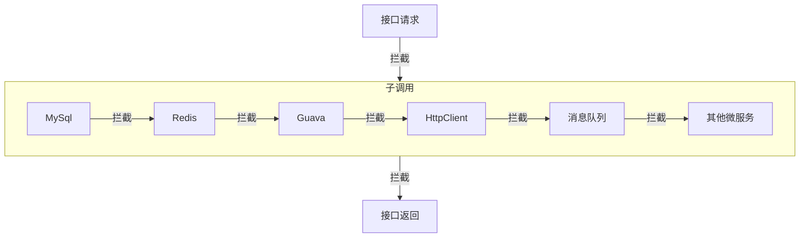
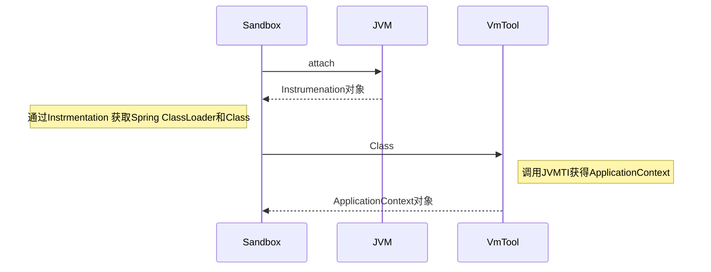

+++
author = "JAS"
title = "整合JVM-SANDBOX与VMTOOL,实现支持OGNL的增强自定义MOCK"
date = "2022-08-19"
description = "jvm文档整理"
tags = [
    "java"
]
+++


## 背景

最近在公司开发基于JVM的“流量录制回放的工具”，简单理解是把生产环境用户的`请求`到`响应`包括过程中的含状态`子组件`,把整个过程入参和返回值录制下来，到测试环境一一回放Mock，达到测试接口子调用覆盖率，上线前不同代码版本运行情况对比等目的，提供更多信息帮助测试和开发同学提高系统健壮性。[市面同行的类似方案](https://xie.infoq.cn/article/501c3f689cfbc0f466628f74b) 

简单流程:



拦截JVM的方案，使用了阿里的[ jvm-sandbox ](https://github.com/alibaba/jvm-sandbox), 原理是attach(或agent形式启动)到运行中的JVM，利用Java提供的`InstrumentationApi`，加载自定义模块，关注对应的拦截点，重新编织字节码到运行中的程序里。

系统的其他部分，也引入了同样是阿里的[Arthas Java工具](https://github.com/alibaba/arthas)，主要用到一些trace方法，反编译代码等功能。

## 问题

就工程复杂度来看，`线上录制`相对复杂度低，主要是系统间的调用，稳定性(过程中不影响正常业务)，在运行一段时间考虑如何把流量逐一落盘存储即可。而到线下`回放Mock`的过程，则会遇到各种的问题，例如机器性能的差异, 组件不完整，网络问题等，其中最大的问题是，**和录制环境状态的差异**。

尽管目前工具拦截了的子调用组件(都是状态相关)已覆盖了日常大部分应用，但实际开发同学实施代码有各种不同的习惯与个例，回放时即时同样的代码，依然会导致有各种执行结果，例如:

1. 子调用组件录制不全 
2. 直接使用本地缓存例如 `ConcurrentHashMap`等
3. 线上录制的一些时间参数与回放时不一致
4. 调用一些非状态相关的ABTest SDK导致走向不同的代码路径
5. 直接代码里写死与环境绑定的逻辑
6. 配置中心不一致

....

目前对回放结果的调优，`参数/响应`用了`JsonPath`的方式去忽略噪音，提高了命中率

例如:

```java
// 入参例子
// 录制到时间是昨天, 回放时把第一个参数忽略不加入匹配
userMapper.selectListGreaterThanDateAndNicknameEq(new Date(), "jas");

// 响应例子
// 调用下游系统，例如个性化推荐，每次返回的结果长度不一样, 影响到下一个调用的入参或最终接口实际响应结果
otherRecommandService.getRecommandList(userId)
```

而其他通过忽略匹配规则没办法匹配到的情况，则使用需要使用`自定义Mock`的方式，去**抹平系统环境状态差异**

例如如下这种情况，只要在测试环境回放时把`envService.isProduction`mock成`true`:

```java

if(envService.isProduction()) {
  // 执行正式环境代码...
} else {
  // 执行dev环境代码...
}

```

例如如下这种情况，如果能把`getUser`mock成返回`指定数据库里的某个用户`:

```java
// 自实现缓存
private static Map<String, User> userCache = new HashMap<>();

private User getUser(String userId) {
    return userCache.get(userId);
}

```

如能达成以上的情况，则可大大方便测试的同学利用流量，在安全的测试环境里做各种链路的测试。在拦截方法方面，sandbox已可达到目的，而`自定义Mock返回`部分，结合到易上手与成熟度，本人则选择了[OGNL](https://commons.apache.org/proper/commons-ognl/language-guide.html)去作为Mock返回值的方案，原因有下:

1. **成熟的Apage项目**, 在MyBatis等大库里均有使用[ 链接 ](https://commons.apache.org/proper/commons-ognl/language-guide.html)
2. **上手非常简单**，与系统的结合和验证都方便，所有语法两三分钟看完，对白盒测试的同学不成问题
3. **返回值丰富**, 基础类型/数组/Map/复杂JAVA对象/私有属性/静态变量等等等，都可以返回
4. **过程运算支持变量**，这可轻松地复用原有系统的基础逻辑

简单演示: 

```java
// 返回数组
Ognl.getValue("{1,3,4,5}")

// 返回Map
Ognl.getValue("#{\"name\": \"JAS\"}")

// map中带复杂对象变量
Ognl.getValue("#user=new User(),#{\"user\": #user}")

// 访问静态类静态
Ognl.getValue("@ContextFactory@traceId")

```

对于第`4`点，Ognl支持复用业务系统业务逻辑返回，我司大多业务系统都使用到`Spring`框架，熟悉Spring的朋友都知道，框架支持已注入的方式去获取`ApplicationContext`类的对象，只要获取到该对象，我们可以调用任意Bean的方法, 例如各种`数据库mapper`, `redisTemplate`, `各种业务Service` 都不在话下。

```java
// Spring原来获取ApplicationContext的方式, 通过Aop注入
@Component
public class SpringContextUtil implements ApplicationContextAware {

    private static ApplicationContext applicationContext;

    @Override
    public void setApplicationContext(ApplicationContext applicationContext) throws BeansException {
        SpringContextUtil.applicationContext = applicationContext;
    }
}
```

但实际我们的视觉是在Sandbox的classLoader里，这和业务运行的classLoader可理解是一个平衡宇宙，即时在sandbox中拦截到例如某个service的方法，但我们也没办法去获取到`实例化好的ApplicationContext对象`。

```java
// sandbox的注入代码示例
new EventWatchBuilder(moduleEventWatcher)
    .onClass("com.jasjojo.UserService") // 拦截类
    .onBehavior("getUser") //拦截方法
    .onWatch((event)-> {
        if(event.Type.equals(event.Before)) {
            event.getAdvice().getTarget() //获取到拦截的对象，但没办法从这个对象获得到SpringContext
        }
    })

```

下面有请决方案[ArthasVmTool](https://arthas.aliyun.com/doc/vmtool.html)

>vmtool 利用JVMTI接口，实现查询内存对象，强制 GC 等功能。

我们可以用官方例子attach一下正在执行的Spring容器, 遍可以获得对象

```bash
# 获取到执行中的ApplicationContext对象，后面也是ognl表达式
$ vmtool --action getInstances --classLoaderClass org.springframework.boot.loader.LaunchedURLClassLoader --className org.springframework.context.ApplicationContext --express 'instances[0].getBeanDefinitionNames()'
```

这一原理是调用了JAVA提供的`JVMTI`接口，但调用该接口需要用到C或C++, 并且如果使用该接口, 则需要考虑跨平台编译(兼容Mac/Windows/Linux), 运行时增加了复杂性，通过查看VmTool的源码，见到C相关核心代码如下

```C
// 对应同名nativejava方法
extern "C"
JNIEXPORT jobjectArray JNICALL
Java_arthas_VmTool_getInstances0(JNIEnv *env, jclass thisClass, jclass klass, jint limit) {
    jlong tag = getTag();
    limitCounter.init(limit);
    jvmtiError error = jvmti->IterateOverInstancesOfClass(klass, JVMTI_HEAP_OBJECT_EITHER,
                                               HeapObjectCallback, &tag);
    if (error) {
        printf("ERROR: JVMTI IterateOverInstancesOfClass failed!%u\n", error);
        return NULL;
    }

    jint count = 0;
    jobject *instances;
    error = jvmti->GetObjectsWithTags(1, &tag, &count, &instances, NULL);
    if (error) {
        printf("ERROR: JVMTI GetObjectsWithTags failed!%u\n", error);
        return NULL;
    }

    jobjectArray array = env->NewObjectArray(count, klass, NULL);
    //添加元素到数组
    for (int i = 0; i < count; i++) {
        env->SetObjectArrayElement(array, i, instances[i]);
    }
    jvmti->Deallocate(reinterpret_cast<unsigned char *>(instances));
    return array;
}
```

简单理解是，只要在运行时，传入想要获取实例对象的Class，变回返回该Class在内存里所有已实例化的对象。自然我们在sandbox的拦截方法过程里，可以获取平衡宇宙业务classLoader里的Class引用，但更好的方法应该是sandbox-agent在初始化`onLoad`时，就尝试去vmtool获取有没有spinrg的`ApplicationContext`对象，这样可以提早作一些预判规则，并缓存起对象引用, 要达到这一点，我们只需要**修改sandbox源码**，让sandbox往下暴露`Instrumentation`对象即可。整体整合方案流程如下:



各部分核心代码如下：

```java
// 修改Sandbox源码, 暴露Instrumentation
public interface ModuleEventWatcher {
    //...

    // 其他实现类都继承这个方法暴露Instrumentation对象
    Instrumentation getInst();
}


// 通过instrumentation获取所有class
public static Set<ClassLoader> getAllClassLoader(Instrumentation inst) {
    Set<ClassLoader> classLoaderSet = new HashSet<ClassLoader>();

    for (Class<?> clazz : inst.getAllLoadedClasses()) {
        ClassLoader classLoader = clazz.getClassLoader();
        if (classLoader != null) {
            classLoaderSet.add(classLoader);
        }
    }
    return classLoaderSet;
}


// VmTool通过Class去获取Spring ApplicationContext对象
// libPath是编译好对应当前系统的c++库位置, 可参考VmtoolCommand，后续工程打包部分详谈
public static synchronized VmTool getInstance(String libPath) {
    if (instance != null) {
        return instance;
    }

    if (libPath == null) {
        System.loadLibrary(JNI_LIBRARY_NAME);
    } else {
        System.load(libPath);
    }

    instance = new VmTool();
    return instance;
}
// 调用的native方法, 返回的范型就是对象列表
private static synchronized native <T> T[] getInstances0(Class<T> klass, int limit);


//Ognl获得Spring对象后的上下文设置，#spring就是一个可用的变量，指向ApplicationContext对象
ClassResolver resolver = new ClassLoaderClassResolver(targetClassLoader);
Map<String, Object> springMap = new HashMap();
springMap.put("spring", springContext); // #spring对象
OgnlContext ognlContext = new OgnlContext( new DefaultMemberAccess(true), resolver, new DefaultTypeConverter(), springMap);

// 如此便可调用到userMapper的查询方法
Object users = Ognl.getValue("#spring.getBean(\"userMapper\".selectList()[0])", ognlContext);

```


最后的工程部分一些细节:
1. 我当前时间2022年8月拉sandbox master最新代码，修改好jvm-sandbox打包编译运行，可能会遇到`java.lang.NoClassDefFoundError: Could not initialize class com.alibaba.jvm.sandbox.core.enhance.weaver.SingleEventFactory`, 参考[pr#Comment](https://github.com/alibaba/jvm-sandbox/pull/355)
2. vmtool引用的c++库，可以用arthas编译好的版本, 也可以用`gcc`自己编译支持苹果arm cpu等
3. 修改源码的方式，像这种非pr的改动，运行稳定后，最好提交到私有仓, 同时维持两个remote分支。未稳定经大量测试时,可build成jar暂时放到resources lib方式去引用
4. **ognl和vmtool会在比较底层去暴露许多系统的调用，只能用在测试环境！！！！！**

最终效果:


